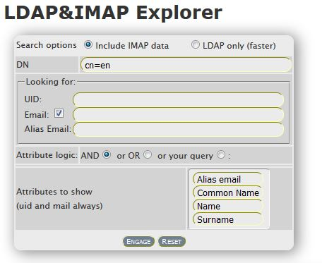

LDAP &amp; IMAP Explorer is a tool to make reports and searches over LDAP profiled mailboxes.

## Abstract
With this tool, you can combine usual LDAP search with IMAP data such as space usage and limit, quota of mailboxes accounts.

A command line interface allows you to make scheduled report, sending mails to any recipients. You can export the reports in Excel file (thanks to PhpSpreadsheet).

## Require
Every mailboxes account must have an LDAP entries like this:

```
dn: ..., <baseDN>
uid: <username>
mail: ...
mailAlternateAddress: ...
mailAlternateAddress: ...
mailhost: <hostname>
...
```

`<hostname>` is the IMAP server (say better "popserver") which contains the account `<username>`.

### system requirements
A version 7 of PHP is very recommended. A web browser as Apache is needed to access to user interface.
- yum install php-ldap
- yum install php-imap

Bootstrap modalbox is linked directly on html and as needed on modal.css.

## Install
- enter in the DOCUMENT ROOT of your web server.
- Git clone this project.
- Install the "falon-common" shared HTML library
- Move `style.css` and `ajaxsbmt.js` in `DOCUMENT_ROOT/include` dir, if your didn't install the "falon-common" by RPM.
- Copy `config.php-default` in `config.php` and configure it as your need.
- `composer require phpoffice/phpspreadsheet`
- mkdir tmp
- chown apache tmp

More detailed info will follow...
